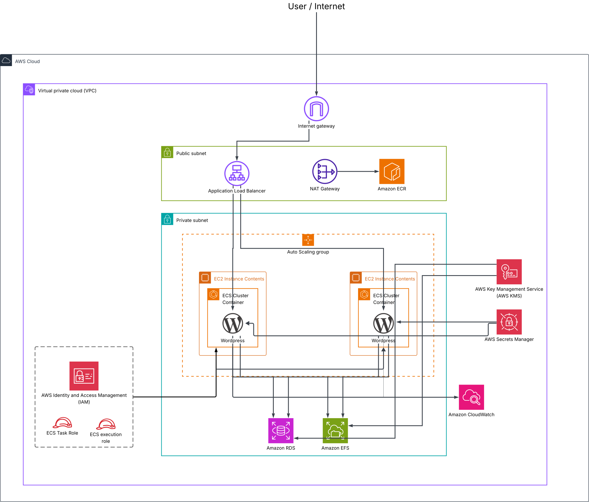

  
Module: CL-ECS-HA | Author: SRE Intern Week 3

## Table of Contents

1. [Architecture Overview](#1-architecture-overview)
2. [Component Reference](#2-component-breakdown)
3. [Prerequisites & Setup](#3-prerequisites--setup)
4. [Deployment](#4-deployment)
5. [High Availability Test](#5-high-availability-test)
6. [Troubleshooting](#6-troubleshooting)
7. [Known Limitations](#7-known-limitations)
8. [Cost Analysis](#8-cost-analysis)
9. [Security Audit Summary](#9-security-audit-summary)
10. [Teardown](#10-teardown)

## 1. Architecture Overview


This system deploys a highly available WordPress environment using containerised orchestration on AWS. The application runs on an ECS cluster (EC2 launch type) across two Availability Zones to ensure zero downtime during instance failure. Persistence is maintained through a shared EFS volume for file storage and a dedicated RDS MySQL database.

```text
Internet ──► IGW ──► ALB (Public)
                      │
        ┌─────────────┴─────────────┐
        ▼                           ▼
  ECS Task (AZ-1)             ECS Task (AZ-2)
  (Private Subnet)            (Private Subnet)
        │                           │
        └──────┬─────────────┬──────┘
               ▼             ▼
          RDS MySQL      EFS Volume
```

The High Availability design utilizes an Application Load Balancer to perform health checks and route traffic only to healthy tasks. ECS automatically restarts failed containers, while the Auto Scaling Group (ASG) maintains the underlying EC2 fleet. EFS provides a multi-AZ storage backend, ensuring data persistence even if an entire AZ becomes unavailable.

The security model employs a strict "Chain of Trust" using Security Group referencing. Database credentials are encrypted at rest via KMS and injected into the container environment at runtime by Secrets Manager. IAM role separation ensures the task execution role only has the minimum permissions required to pull images and decrypt secrets.

## 2. Component Reference

| Component | AWS Service | Purpose | Free Tier | Verified Monthly Cost |
|---|---|---|---|---|
| VPC | VPC | Isolated network | 12-month free | $0.00 |
| NAT Gateway | NAT GW | Outbound access | None | $32.85 |
| ALB | ALB | Traffic ingress | None | ~$22.27 |
| EC2 (×2) | t2.micro | ECS cluster nodes | 12-month, 750 hrs/mo (1 free) | $8.47 |
| RDS MySQL | db.t3.micro | DB storage | None | $12.41 |
| EFS | EFS | Shared files | 12-month, 5GB free | $0.30 |
| Secrets Manager | Secrets | DB credentials | None | $0.40 |
| KMS CMK | KMS | Encryption | None | $1.00 |
| CloudWatch | CloudWatch | Monitoring | 10 metrics/alarms free | $5.00 |
| **TOTAL** | | **Initial Dev Estimate** | | **~$82.70** |

## 3. Prerequisites & Setup

| Tool | Minimum Version | Install Link |
|---|---|---|
| Terraform | ≥ 1.5.0 | [Install](https://developer.hashicorp.com/terraform/install) |
| AWS CLI | v2 | [Install](https://docs.aws.amazon.com/cli/latest/userguide/install-cliv2.html) |
| Git | Any | [Install](https://git-scm.com/downloads) |
| jq | Any | [Install](https://stedolan.github.io/jq/download/) |

Configure AWS credentials to grant Terraform access to your account:

```bash
aws configure
```

Clone the project repository and navigate to the Week 3 directory:

```bash
git clone <repository-url>
cd "xgrid-internship-bootstrap/week 3"
```

Initialize the remote state backend using the bootstrap script. This script creates an S3 bucket with versioning and encryption to store the Terraform state file securely.

```bash
chmod +x scripts/create-remote-state.sh
./scripts/create-remote-state.sh
```

Update your `environments/dev/terraform.tfvars` with your project-specific details:

```hcl
aws_region   = "us-east-1"
environment  = "dev"
project_name = "wordpress-ecs-ha"
owner_name   = "your-name"
alert_email  = "you@example.com"
```

## 4. Deployment

Initialize the environment and review the execution plan to verify all resources:

```bash
cd environments/dev
terraform init
terraform validate
terraform plan -out=tfplan
```

Apply the configuration to provision the infrastructure:

```bash
terraform apply tfplan
```

| Resource | Estimated Time |
|---|---|
| VPC Networking | 30s |
| RDS MySQL | 12m |
| ECS Cluster | 5m |
| ALB | 3m |
| **Total** | **~22m** |

> [!IMPORTANT]
> **SNS Confirmation:** Check your inbox for an AWS Subscription Confirmation email. You must click the link inside to receive CloudWatch alarm notifications.

Verify the deployment with these standard checks:

```bash
# 1. Reachability
curl -I http://$(terraform output -raw alb_dns_name)

# 2. Service Status
aws ecs describe-services --cluster wordpress-ecs-ha-dev-cluster --services wordpress-ecs-ha-dev-wordpress-svc --region us-east-1 --query "services[0].{Running:runningCount,Desired:desiredCount}" --output table

# 3. DB Status
aws rds describe-db-instances --db-instance-identifier $(terraform output -raw rds_identifier) --region us-east-1 --query "DBInstances[0].DBInstanceStatus"

# 4. Task Health
aws ecs list-tasks --cluster wordpress-ecs-ha-dev-cluster --region us-east-1 --desired-status RUNNING

# 5. Secret Integrity
aws secretsmanager get-secret-value --secret-id wordpress-ecs-ha/dev/db-credentials --region us-east-1 | jq '.SecretString | fromjson | keys'
```

## 5. High Availability Test

High Availability (HA) ensures that if one part of the system fails, the rest remains operational. In this environment, we test HA by killing a healthy task and watching the ECS Service Scheduler automatically replace it while the website remains accessible via the Load Balancer.

Identify and terminate a running task:

```bash
# 1. Identify task
TASK=$(aws ecs list-tasks --cluster wordpress-ecs-ha-dev-cluster --region us-east-1 --query "taskArns[0]" --output text)

# 2. Kill task
aws ecs stop-task --cluster wordpress-ecs-ha-dev-cluster --task $TASK --reason "HA Test" --region us-east-1
```

Monitor the recovery process:
```bash
watch -n 5 "aws ecs describe-services --cluster wordpress-ecs-ha-dev-cluster --services wordpress-ecs-ha-dev-wordpress-svc --region us-east-1 --query 'services[0].{Running:runningCount,Desired:desiredCount}' --output table"
```
Successful test proves the scheduler maintains availability: `Running: 2 → 1 → 2`.

## 6. Troubleshooting

### ECS Tasks Not Starting (RunningCount = 0)
*   **Diagnosis:**
    ```bash
    aws ecs describe-tasks \
      --cluster wordpress-ecs-ha-dev-cluster \
      --tasks $(aws ecs list-tasks --cluster wordpress-ecs-ha-dev-cluster --desired-status STOPPED --region us-east-1 --query "taskArns[0]" --output text) \
      --region us-east-1 \
      --query "tasks[0].{StopReason:stoppedReason,Error:containers[0].reason}"
    ```
*   **Fix:** Terminate EC2 instances to force ASG to launch fresh nodes if the ECS agent has failed to join the custom cluster.

### WordPress Not Loading (ALB Health)
*   **Diagnosis:** Check Target Group Health in EC2 Console or via CLI:
    ```bash
    aws elbv2 describe-target-health --target-group-arn <tg-arn-from-output>
    ```
*   **Fix:** Ensure Security Group rules allow Port 80 from ALB to ECS nodes. Verify task is actually running and responsive on internal IP.

### "Error establishing a database connection"
*   **Diagnosis:**
    ```bash
    aws secretsmanager get-secret-value --secret-id wordpress-ecs-ha/dev/db-credentials --region us-east-1 | jq '.SecretString | fromjson'
    ```
*   **Fix:** Confirm the `host` field in the secret matches the current RDS endpoint. Re-run `terraform apply` to refresh secret values.


### Terraform Apply Failures
*   **Diagnosis:** Review CLI error output.
*   **Fix:** For `ResourceAlreadyExists`, import the resource into state. For `BucketAlreadyExists`, choose a unique project name.

## 7. Known Limitations

| # | Limitation | Why Accepted for Dev | Production Fix |
|---|---|---|---|
| 1 | HTTP Only | No domain or ACM cert in scope | Register domain and attach ACM cert to ALB |
| 2 | Single NAT GW | Cost savings ($32.85/mo each) | Deploy one NAT Gateway per AZ |
| 3 | No VPC Endpoints | NAT handles API traffic | Add endpoints for Secrets, ECR, and CloudWatch |
| 4 | RDS Single-AZ | Multi-AZ doubles RDS costs | Enable `multi_az = true` in RDS configuration |
| 5 | No WAF | Simple architecture scope | Attach AWS WAF Web ACL to the ALB |
| 6 | Mutable Image Tag | Ease of initial development | Pin image to immutable digest or private ECR |
| 7 | Silent Alarms | SNS topic is in separate module | Map `sns_topic_arn` to RDS and ALB modules |

## 8. Cost Analysis

### Dev Monthly Breakdown
| Service | Config | Free Tier? | Monthly Cost |
|---|---|---|---|
| NAT Gateway | 1× Base + 1GB Data | None | $32.85 |
| ALB | 1× Base + 1 LCU | None | ~$22.27 |
| EC2 | 2× t2.micro | 1 Instance Free | $8.47 |
| RDS | db.t3.micro | None | $12.41 |
| EFS | 1GB Storage | 5GB Free | $0.00 |
| KMS | 1× CMK | None | $1.00 |
| CloudWatch | Dashboard + Metrics | 10 Metrics Free | $5.00 |
| Secrets Manager | 1× Secret | None | $0.40 |
| **TOTAL** | | | **~$82.70** |

### Free Tier Accuracy Note
The free tier only covers **one** t2.micro instance. Running two instances for HA results in a charge for the second instance (~$8.47). Additionally, **db.t3.micro is not free tier eligible**; only the older db.t2.micro is covered. EFS and CloudWatch remain largely free within standard dev usage limits.

### Cost Optimization Tips
1.  Execute `terraform destroy` when not actively testing to stop NAT/ALB hourly billing.
2.  Add an S3 Gateway Endpoint to eliminate data transfer charges for state files.
3.  Migrate to t3.micro instances for better performance at the same price point.
4.  Maintain 7-day CloudWatch log retention to prevent infinite storage billing.
5.  Use EFS Lifecycle Management to transition unused data to Infrequent Access.

### Production Projection
| Service | Production Config | Monthly Cost |
|---|---|---|
| EC2 Nodes | 4× t3.medium | $120.00 |
| RDS DB | db.t3.medium Multi-AZ | $100.00 |
| Load Balancing | High Traffic ALB | $40.00 |
| NAT Gateway | 2× Gateways (HA) | $65.70 |
| VPC Endpoints | Full Interface Suite | $35.00 |
| Security | AWS WAF + GuardDuty | $15.00 |
| **TOTAL** | | **~$375.70** |

## 9. Security Audit Summary

A production-readiness audit identified the following security improvements and remaining gaps.

### Issues Fixed During Development
| # | Issue | Fix Applied |
|---|---|---|
| 1 | Hardcoded DB Password | Migrated to Secrets Manager with KMS encryption |
| 2 | Wide Ingress Rules | Implemented Security Group referencing (Chain of Trust) |
| 3 | Public RDS Access | Moved RDS and ECS nodes to isolated private subnets |
| 4 | Open NFS Access | Enforced TLS and IAM authentication on EFS Access Point |

### Known Security Gaps
| Severity | Gap | Production Fix |
|---|---|---|
| HIGH | KMS policy uses broad Principal | Scope policy to specific IAM role ARNs |
| HIGH | No VPC Endpoints | Provision interface endpoints for all AWS APIs |
| MEDIUM | Silent Alarms | Pass SNS topic ARN to all alerting resources |
| LOW | Mutable Image Tag | Use specific image digests or private ECR |

## 10. Teardown

🚨 **Warning:** The NAT Gateway and ALB accrue charges hourly regardless of traffic. Always destroy the environment when testing is complete.

```bash
cd environments/dev
terraform destroy
```

Verify cleanup across the account:
```bash
aws rds describe-db-instances --region us-east-1
aws ecs list-clusters --region us-east-1
aws elbv2 describe-load-balancers --region us-east-1
```
Note: Manual cleanup of the S3 state bucket may be required if no longer needed.
